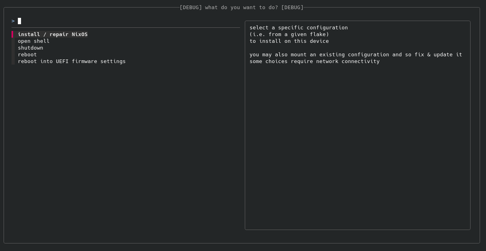
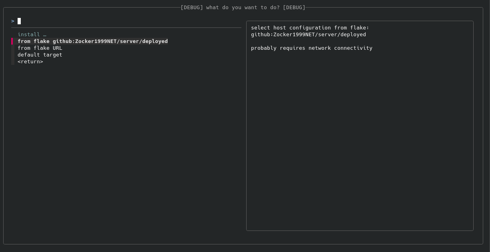
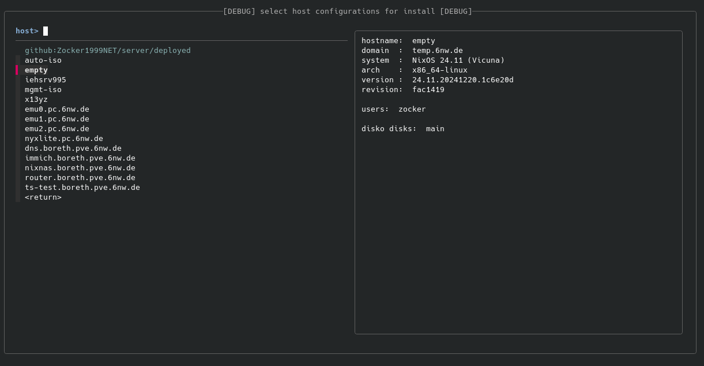
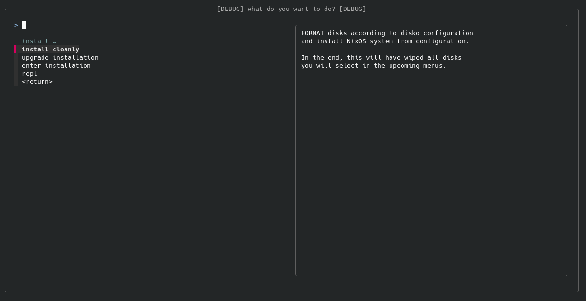
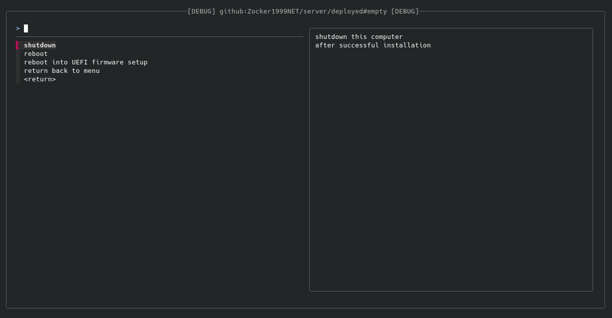
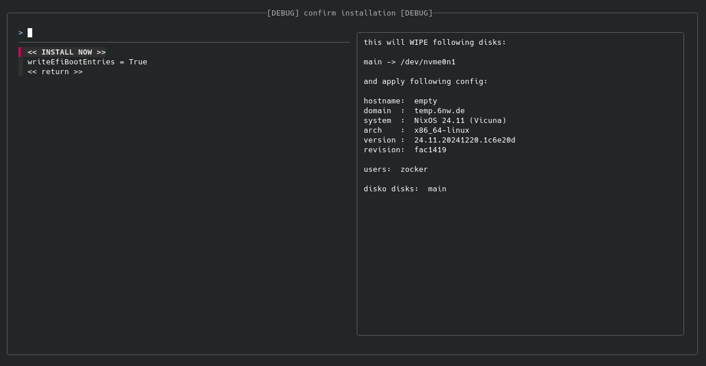

# disko-install-menu for NixOS Configurations in Flakes

If you are

- using [NixOS](https://nixos.org/) on your hosts (PCs, servers, RPis, …)
- managing the configurations of your hosts in a (rather central) flake
  - which is published somewhere, for the installer ISO to find
  - or you want to make it easy for others to deploy the configuration of your flake on their PCs
- happy to use [disko](https://github.com/nix-community/disko) as a declerative disk partitioning tool

then this the installation & setup UI you always wanted!

This setup menu is optimized for:
- personalized deployments of a number of machines
  - but for scales of a large homelab / small enterprise
- replacing tedious click working


## Disclaimer / Requirements

This tool is **not inheritly user-friendly**.
You should already be familiar with Nix & NixOS
or be ready to learn a lot more new stuff
before you can start to just use this tool.

If you want to try out NixOS on your first machine,
start by downloading an official [NixOS ISO](https://nixos.org/download/#nixos-iso)
and working through the first sections of the [NixOS Manual](https://nixos.org/manual/nixos/stable/).

The menu itself is intentionally designed to be easy to navigate,
even to make this tool accessible to non Linux / NixOS experts.
But this is intended to be used by NixOS exports
to publish *their* configurations
for use in a *blackbox-lite* fashion
(i.e. where users cannot fix bugs themselves but have to hope that everything just works).
And such a release should come with at least some support,
e.g. in case of errors during the installation.
Because of this, I will not just release a ISO for anyone to just use this setup menu.


## Features

This tool replaces the sometimes tedious chore
of typing following command each time you need to (re-)install NixOS:

```bash
# example command
disko-install --flake "github:Zocker1999NET/server#empty" --mode format --write-efi-boot-entries --disk main /dev/nvme0n1 --disk data /dev/sda
```

Instead, you get a simple UI guiding you through each installation, asking you:
- which configuration you want to install
  - a default can be proposed
  - but the menu can propose you all configs your flake publishes via its `nixosConfigurations` output
  - or you can even insert a new flake URI, if you want to try something out
- whether you want to format everything OR mount & upgrade/fix an existing installation
- which disko disks (configurations) map to which (physical) disks
  - while showing you the current content of the disk using `lsblk`
  - and showing more information like serial numbers as read by `smartctl`
- if the host should shutdown / reboot on success
  - on error, it will stop & show you the error message



<details>

<summary>More Screenshots (of All Question Screens)</summary>








</details>


## Quick Start

As a short summary, you should:
- publish your flake with the configurations you want to install
- add this to your flake’s inputs
  - required in the flake used to build the installation ISO
  - you can refer to another flake containing your actual configurations, as you see fit
- configure a NixOS configuration which is live bootable
  - similar to (or derived from) the official, non-graphical NixOS installer
- add & configure the disko-install-module in your installation configuration
- build an ISO from this configuration
- boot from the ISO & install **-> profit!**

### Publish Your Configurations

The current implementation of this menu
requires your configurations to be accessible somehow over the network.
The easiest would be to publish your flake on some Git-hosting forge (GitHub, GitLab, Forgejo, …).

Maybe someone will find a way to embed a flake into the installation ISO,
but as one purpose of this menu was to always deploy the *newest* configuration available,
without needing to regularly rebuild the ISO, this is mandatory for now.

### Add to Flake Input

For example, this could look like:


```nix
{
  inputs = {
    # … (e.g. nixpkgs)
    disko-install-menu = {
      url = "github:Zocker1999NET/disko-install-menu";
      # this is recommended to do (I will NOT regularly update the flake.lock)
      # (& should hopefully not introduce any errors)
      inputs.nixpkgs.follows = "nixpkgs";
    };
  };
}
```

The `main` branch is expected to be as stable as possible.

### Configure Live-Bootable NixOS Configuration + disko-install-menu

Because of the nature of Nix, this is really easy to achieve:
We can piggy-back on [nixpkgs](https://github.com/NixOS/nixpkgs) as we see fit.

Assuming you embed everything into your `flake.nix`,
this could look like this (not tested, please report your success / issues):

```nix
{
  outputs =
    { nixpkgs, disko-install-menu, ... }:
    let
      inherit (nixpkgs.lib) nixosSystem;
    in
    {
      nixosConfigurations.installer = nixosSystem {
        modules = [
          # setup live-bootable installer
          (
            { config, lib, modulesPath, ... }:
            {
              imports = [ "${modulesPath}/installer/cd-dvd/installation-cd-minimal.nix" ];
              config = {
                isoImage.isoBaseName = "nixos-my-setup";
                networking.hostName = "nixos-my-setup";
                system.stateVersion = lib.versions.majorMinor config.system.nixos.version;
              };
            }
          )
          # configure disko-install-menu
          disko-install-menu.nixosModules.default
          {
            programs.disko-install-menu = {
              enable = true;
              options = {
                # set those to your liking
                defaultFlake = "github:Zocker1999NET/server";
                defaultHost = "empty";
              };
            };
          }
          # and everything else you think you might need …
        ];
        system = "x86_64-linux";
      };
    };
}
```

### Build Installation ISO

Given you are in the directory of your flake
and your configuration is called as in the example above,
you can build an ISO with following command
(use [nom](https://github.com/maralorn/nix-output-monitor) for a better visualization):

```
nix build .#nixosConfigurations.installer.config.system.build.isoImage
```

Your ISO will then be available as `result/iso/*.iso` (the only ISO) in that directory.

### Boot Your ISO

I assume you will get this working somehow,
e.g. see the awesome [ArchWiki](https://wiki.archlinux.org/title/USB_flash_installation_medium) for an exhaustive list of possibilities.

Be aware that in the current version,
the module cannot yet auto-start the installer (feel free to make a PR),
so, as of now, you need to type the following (with auto-completion) to start the menu:
```bash
sudo disko-install-menu
```
(still shorter & simpler than the whole `disko-install` command)


## License

<!-- SPDX-License-Identifier: MIT -->
The content of this repository is licensed under the MIT license.
You are free to use & modify the content of this repository.
You are asked to contribute your improvements back to the FLOSS community,
e.g. by making a PR into this repository.

A copy of the MIT license is [attached](./LICENSE) to the repository.
